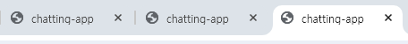
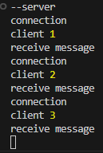
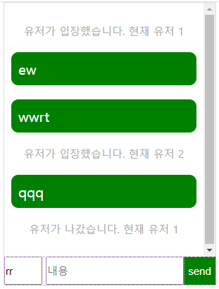

# chatting-app
WebSocket을 이해하기 위해 유저채팅을 만들어 봤다.

## 사용한 기능
ws 라이브러리 사용 (https://www.npmjs.com/package/ws)      
node에서 server 임시 구현

## WebSocket
client와 server간 양방향 통신을 가능하게 함
1. 웹소켓의 특징             
- HTTP기반이 아닌 TCP 프로토콜 기반          
    - client와 server간 연결 유지         
        - 실시간 데이터 전송을 가능하게 함            
    - 최소한의 헤더 정보를 사용하여 데이터 전송 (낮은 오버헤드 )
    - 한번 연결하면 닫기 전까지 지속적인 통신 가능
2. 웹소켓이 작동방식
    - 연결 시작               
        핸드셰이크 (Handshake) 실행 :          
        http 요청을 서버에 보내고 http 연결을 websocket 연결로 전환됨
    - 연결 후                 
        데이터 주고 받기 가능
    - 연결 닫기               
        client || server에서 close를 통해 연결을 종료할 수 있음

## 기본 셋팅
1. 터미널에 ws 설치       
js에서는 WebSocket API가 존재하지만 Node.js에서는 해당 모듈이 없기 때문에 ws 라이브러리를 이용했음.
```
npm i ws
```
2. server.js 생성
```
const ws = require('ws')

const server = new ws.Server({ port: 5501 })

server.on('connection', (socket) => {
    socket.on('message', () => {
        console.log('receive message')
    })
})
```
3. client 셋팅
```
const socket = new WebSocket('ws://localhost:5501');

socket.addEventListener("open", () => {
    console.log('open')
    socket.send("open");
})
```
4. 터미널에 server 실행
```
node server.js
```
5. localhost/chat.html 확인

## 진행과정
1. client 몇 명인지 확인 후 터미널 확인      
   


2. client에서 내용을 작성 후 server에 send           
3. server에서 모든 client에게 메세지를 send          


## 후기
예전에 zep 프로젝트를 하면서 전체 유저에게 특정 컨텐츠를 보여주거나 개인 유저에게만 보여줘야하는 내용을 진행을 한 경험이 있어서 그런지 비슷한 맥락이라 금방 이해가 가능했다.
client에서 내용을 보내면 server에서 reflect만 하는 특별한 기능이 없지만 websocket의 기본 동작 방식을 이해하는데 도움이 되었다.

- 다음 구현 사항 
    - 개인 메세지 전송 - 알림을 누르면 개인에게만 특정 메세지가 보내지도록 설정
    - 방 기능 - 특정 방에서만 메세지가 전달
    - json으로 보낸 사람이나 내용으로 정보를 체크
    - 메세지 시간표시
    - 이모지 파일 전송
